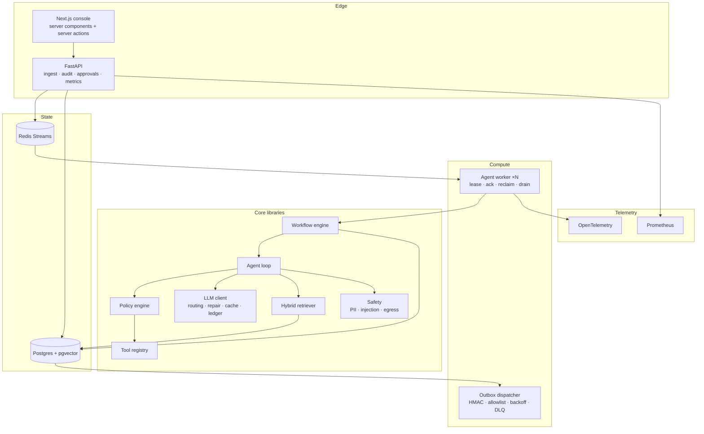
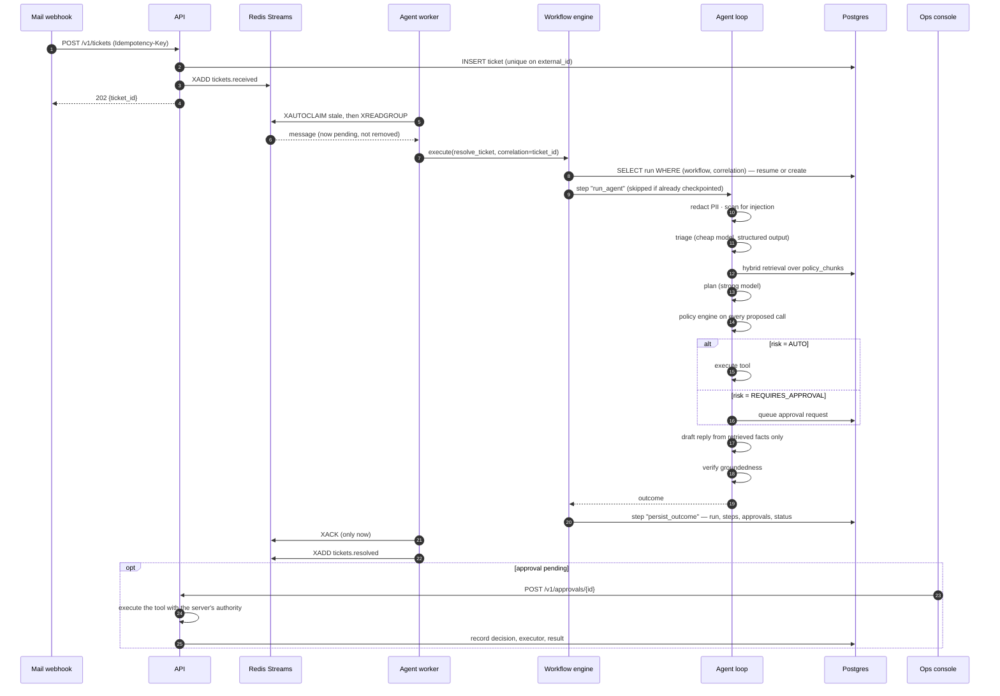
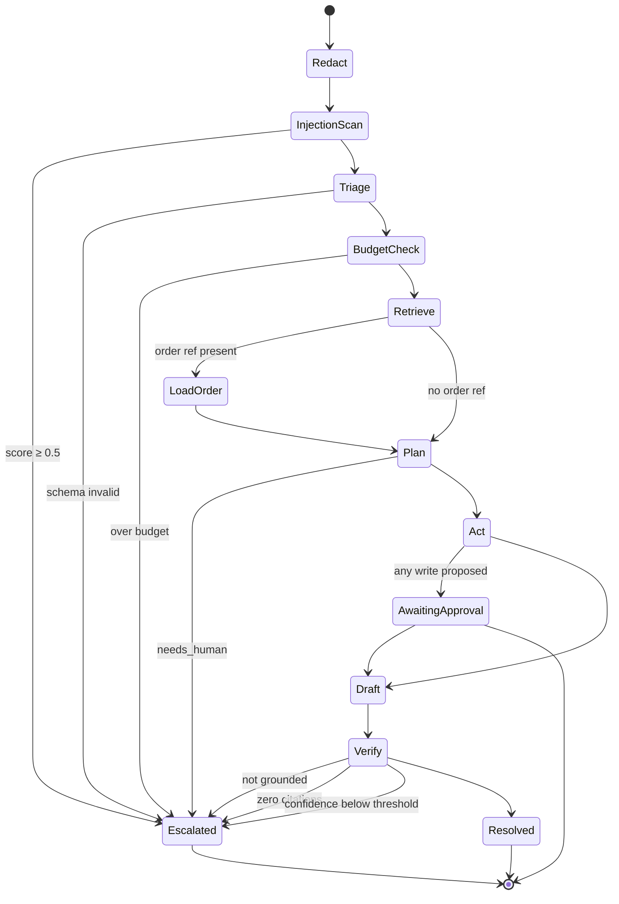
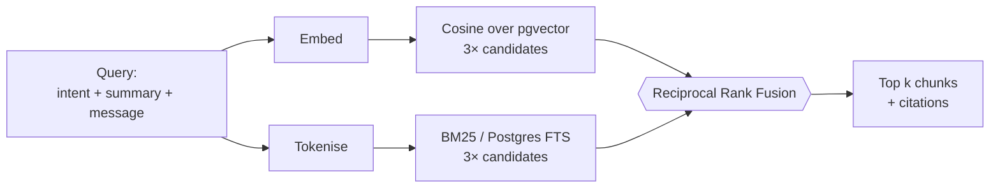
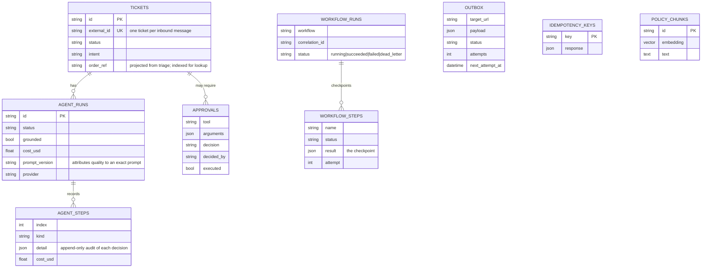
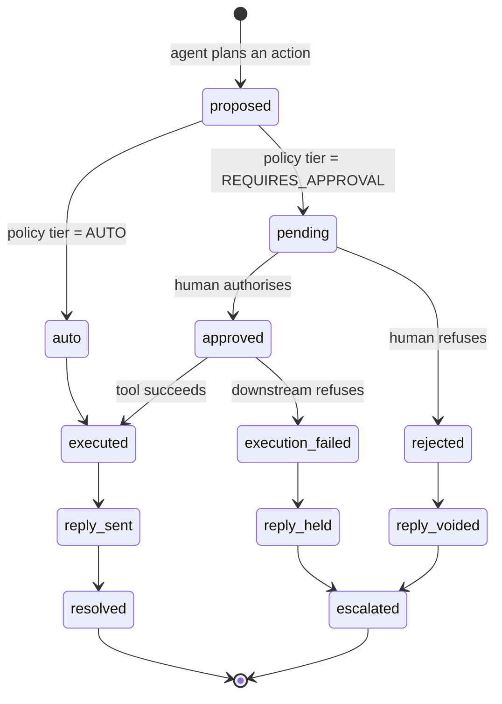

# System Architecture

## 1. Context

Resolve sits between a retailer's inbound customer channel and its commerce systems.

```mermaid
flowchart LR
    C([Customer]) -->|email| MB[Mail / helpdesk]
    MB -->|webhook| R{{Resolve}}
    R -->|reads and acts| COM[(Commerce platform<br/>orders · payments · shipping)]
    R -->|retrieves| POL[(Policy corpus)]
    R -->|drafts reply| MB
    R -->|approval requests| OPS([Operations team])
    OPS -->|approve / reject| R
    R -->|signed webhooks| DOWN[Downstream systems]

    style R fill:#0d1117,stroke:#4c9aff,stroke-width:2px
```

Three deliberate boundaries:

* **Resolve never talks to the customer directly.** It hands a drafted reply back to the
  channel that owns the conversation. Owning the mailbox would double the blast radius
  for no benefit.
* **The commerce platform is behind a protocol** (`services/commerce.py`). The bundled
  implementation is a simulator; a Magento, Shopify or BigCommerce adapter satisfies the
  same six methods and nothing above it changes.
* **The operations team is part of the system, not a fallback.** The approval queue is a
  designed path, not an error path.

## 2. Components

| Component | Responsibility | Why it is separate |
|---|---|---|
| **API** | Idempotent ingest, the read-only audit trail, approval decisions, analytics, metrics | The only component with write authority over commerce actions |
| **Agent worker** | Consumes tickets, drives the durable workflow | Scales horizontally; a crash loses nothing |
| **Outbox dispatcher** | Delivers outbound webhooks | Isolated so a slow receiver cannot back-pressure ticket processing |
| **Workflow engine** | Checkpointing, retries, resume, dead-letter | The one place where "exactly once" is enforced |
| **Agent loop** | Triage → retrieve → plan → act → draft → verify | Pure; depends only on protocols, so it is fully testable offline |
| **Policy engine** | Decides allow / require-approval / deny | Deterministic and reviewable by a non-programmer |
| **Console** | Human review and approval | Holds no credentials; every mutation is a Server Action; reads *all* state through the API, including evaluation results |

## 3. Request lifecycle

**The acknowledgement is last.** If the worker dies at any point before `XACK`, the
message stays pending and another worker reclaims it after the idle timeout. The
workflow then resumes from its last checkpoint — it will not re-triage, will not pay
for the model again, and above all will not re-issue a refund.

## 4. The agent loop in detail

Every transition into `Escalated` is a *designed* outcome carrying a human-readable
reason, which the console renders verbatim. There is no path in which the agent
proceeds with reduced confidence and hopes.

### Bounds

| Bound | Default | Behaviour at the limit |
|---|---|---|
| Steps per ticket | 8 | Loop terminates, escalates |
| Tool calls per ticket | 6 | Extra planned calls are dropped |
| Retrieved chunks | 6 | Ranked by fused score, truncated |
| Spend per ticket | $0.25 | **Escalates** — never continues with less context |
| Schema-repair attempts | 2 | Raises, which escalates |
| Refund without a human | £25 | Queued for approval |
| Citations to auto-send | 1 | Escalates with the draft attached |
| Confidence to act | 0.70 | Escalates |

## 5. Retrieval

Neither retriever is adequate alone, and the failure cases are complementary:

* *"my parcel never showed up"* shares **no keyword** with the policy heading
  *"Delayed or missing parcels"*. Dense retrieval finds it; BM25 does not.
* *"14 days"*, *"ORD-400012"*, *"pre-authorisation"* are exact terms. BM25 finds them
  reliably; dense retrieval washes them out.

Reciprocal Rank Fusion combines them without needing to normalise two incomparable score
scales, and degrades gracefully when one side returns nothing useful. Both behaviours
are asserted in `tests/test_retrieval.py`.

Chunking is heading-aware with a size ceiling: the heading is prepended to every chunk it
covers, so a chunk retrieved alone still carries its context and cites meaningfully.

## 6. Data model

Constraints that carry real weight:

| Constraint | Prevents |
|---|---|
| `UNIQUE (tickets.external_id)` | A webhook firing three times creating three tickets |
| `UNIQUE (workflow_runs.workflow, correlation_id)` | Two workers starting two runs for one ticket |
| `UNIQUE (workflow_steps.run_id, name)` | A checkpoint being written twice |
| `idempotency_keys` PK | A client retry duplicating a request |

## 7. Failure modes

| Failure | Detection | Behaviour | Recovery |
|---|---|---|---|
| Agent worker killed mid-run | Message never acknowledged | Stays pending in the consumer group | Another worker reclaims after `claim_idle_ms`; workflow resumes from the last checkpoint |
| Model provider times out | Exception in a workflow step | Retried with exponential backoff and full jitter | Three attempts, then the run dead-letters with its error preserved |
| Model returns invalid JSON | Pydantic validation fails | One repair turn feeding the error back | Then `StructuredOutputError`, which escalates — never a guess |
| Commerce API rejects an action | `CommerceError` | Captured as a failed `ToolResult` with the reason | The agent relays the reason; it does not retry a business-rule refusal |
| Retrieval returns nothing | Zero chunks | Draft proceeds with no citations | Fails the citation floor and escalates |
| Verification fails | `grounded = false` | Reply is not sent | Escalated with the draft attached — still faster than writing from scratch |
| Budget exhausted | Ledger exceeds the ceiling | Loop stops | Escalates, flagged `budget_exceeded` |
| Prompt injection | Signal scan on the raw message | Escalates before planning | Zero tool calls; nothing is read or written |
| Webhook receiver down | Non-2xx or timeout | Outbox retries with backoff | Six attempts, then `dead_letter` for replay |
| Webhook target not allowlisted | `EgressViolation` | Marked `rejected`, **never retried** | Retrying a forbidden target is pointless and dangerous |
| Postgres unavailable | `/readyz` reports `database: error` | API returns degraded readiness | Workers back off; nothing is lost, because nothing was acknowledged |

### What the audited predecessor got wrong

This design is a direct answer to specific findings in the portfolio audit of an earlier
payment-automation system:

| Finding | What went wrong there | What is different here |
|---|---|---|
| In-memory queue | Queued payment jobs were a JavaScript array; every deploy destroyed them silently | Postgres + Redis Streams; nothing operational lives in process memory |
| At-most-once delivery | `GET /next` removed the job before the worker did anything | Lease + acknowledge + automatic reclaim |
| No idempotency | Re-enqueuing created duplicate jobs | Unique constraints and idempotency keys at three levels |
| SSRF | A caller-supplied `webhook` URL was fetched server-side with no validation | `EgressGuard`: scheme check, host allowlist, private/link-local block |
| Unsigned callbacks | Receivers could not verify a callback was genuine | HMAC-SHA256 with a timestamp and a replay window |
| Timing-unsafe auth | Shared token compared with `===` | `secrets.compare_digest` |
| Boot failure on missing config | A module-level `throw` for an unrelated feature took down the whole API | Validated settings, feature-flagged adapters, `/readyz` naming the degraded dependency |
| Errors swallowed | A failed browser flow returned HTTP 200 | Typed results; every failure surfaces with a reason |

## 8. Scaling

| Dimension | Current | Limit | Next step |
|---|---|---|---|
| Ticket throughput | 2 workers | Consumer-group parallelism; Postgres write contention first | Partition by tenant; add read replicas |
| Retrieval corpus | ~25 chunks in memory / pgvector | Exact cosine slows past ~100k chunks | HNSW index (`ivfflat` / `hnsw`); already the same interface |
| Model spend | $0.0175 per ticket (baseline) | Budget ceiling is per-ticket, not global | Global daily cap; semantic cache across tickets |
| Approval queue | Unbounded | Human throughput | SLA timers, auto-expiry, routing by tool and value |
| Workflow engine | Postgres polling | Thousands of runs per minute | Temporal — the interface is deliberately Temporal-shaped |

## 9. Human authorisation and audit

Resolve keeps five concerns apart, and the boundaries are where the interesting
engineering is:

| Concern | Owner | Question it answers |
|---|---|---|
| AI decision-making | `agent/loop.py` | What should be done? |
| Policy enforcement | `agent/policy.py` | May the agent do it alone? |
| Human authorisation | `oversight.py` | Does a person permit it? |
| Execution | `agent/tools/` | Did it actually happen? |
| Auditability | `agent_steps`, `approvals` | Who decided, when, and why? |

**Decision is not outcome.** `decision` records what a person intended;
`outcome` records what happened. An approved refund the commerce backend then
refuses is `approved` / `execution_failed` — a state neither field can express
alone, and the one most likely to be papered over.

**The reply has its own lifecycle.** A draft written on the assumption a refund
would be issued is not a sent message. `ReplyState` distinguishes
`provisional`, `awaiting_approval`, `sent`, `voided` and `held`, so a rejected
action can never leave a reply on screen that implies it happened.

**One trace, attributed.** Human decisions are appended to the same
`agent_steps` timeline the agent wrote, tagged `actor_type = human`. A reviewer
reads a ticket top to bottom and sees exactly where the machine stopped and a
person took over.

**Reconciliation reads every approval.** Ticket state is recomputed from all
approvals on the ticket, not from the decision just made. Deciding each in
isolation meant the last one won — approve one action, reject another, and the
ticket could end up `resolved` carrying a refused action.

### Oversight is not evaluation

| | Evaluation | Oversight |
|---|---|---|
| Question | Did the AI behave per the golden set? | What did humans do about its proposals? |
| Input | Fixed, versioned cases | Real processed tickets |
| Endpoint | `/v1/evals/latest` | `/v1/oversight`, `/v1/audit` |
| Gated in CI | Yes | No — it is a count, not a measurement |

A system can score 30/30 while operators reject most of what it proposes.
Merging the two would hide precisely that.

## 10. Evaluation results are served, not shared

The console displays the latest evaluation report. It gets it from
`GET /v1/evals/latest`.

It did not always. The page originally read
`evals/results/latest-*.json` off the filesystem, which worked in a developer
checkout and failed in Docker: the console image is built from `./console`, so
`evals/` is not in its filesystem at all. The page reported "No evaluation
report found" on a stack where the report existed and the API container could
read it perfectly well.

```mermaid
flowchart LR
    subgraph before["Before — a coincidence of local layout"]
        H1[make eval] -->|writes| F1[(evals/results/*.json)]
        F1 -.->|"reads ../evals — absent in Docker"| C1[Console]
        C1 --> X(["No evaluation report found"])
    end

    subgraph after["After — a shared contract"]
        H2[make eval<br/>runs in the api container] -->|writes| V[(evalresults volume)]
        V --> S[EvaluationStore<br/>validates against the schema]
        S --> E["GET /v1/evals/latest"]
        E --> C2[Console]
    end

    style X fill:#2a1416,stroke:#f2666f
    style E fill:#0d1117,stroke:#4c9aff
```

Three things this fixed beyond the immediate symptom:

* **One model, not two.** The report shape is defined once in
  `resolve.domain.evaluation` and imported by both the harness that writes it
  and the API that serves it. A field cannot exist on one side and be missing
  on the other; a contract test asserts they are literally the same class.
* **Results are runtime state, so they live in a volume.** They are excluded
  from the image by `.dockerignore` — an image that shipped a report would show
  results from whenever it happened to be built — and mounted at
  `/app/evals/results` so they survive container recreation.
* **The failure modes are distinguishable.** 404 for "no run yet", 500 for
  "a report exists but does not validate". A malformed report is never
  partially parsed into something that looks like results.

## 11. Observability

**Traces.** OpenTelemetry spans cover ingest → lease → workflow → each agent stage →
tool call → outbound webhook, correlated by `ticket_id`.

**Metrics.** Prometheus at `/metrics`:

| Metric | Why it is on the dashboard |
|---|---|
| `resolve_tickets_processed_total{status,intent}` | Autonomy rate, and its drift |
| `resolve_groundedness_failures_total{intent}` | **The one to alert on.** A rise means the agent is starting to make claims it cannot support |
| `resolve_agent_cost_usd_total{provider,model}` | Unit economics, live |
| `resolve_agent_duration_seconds` | Latency distribution, not the mean |
| `resolve_approvals_pending` | Human queue depth — the real bottleneck at scale |
| `resolve_queue_depth{topic}` | Back-pressure |
| `resolve_outbox_pending` | Undelivered notifications |
| `resolve_llm_cache_hit_rate` | Whether caching is earning its complexity |

**Logs.** Structured JSON with a `correlation_id` threaded through every process, so one
customer ticket is a single greppable trail across the API, the worker and the dispatcher.

**Audit.** `agent_steps` is append-only and holds the full decision record for every run,
including runs a human later overrode. That is what makes an AI system answerable after
the fact rather than merely explainable in principle.
